Welcome to [Edu Fun Zone](https://ebychacko.github.io/project2_game/),

Edu Fun Zone is a website that combines fun and education in two main features: a Tic Tac Toe game and a calculator. The Website is created Using HTML, CSS and JavaScript.

The game is turn-based, where the aim is to line up a trifecta of circles or crosses diagonally, horizontally, or vertically on a 3×3 square grid to achieve victory. 

 The calculator feature can be used to perform basic arithmetic operations such as addition, subtraction, multiplication, division and persentage. The website is designed to be both entertaining and educational, providing a fun way for users to learn and practice their math skills.

 # How to Use

To access our website, simply visit https://ebychacko.github.io/project2_game/. 

# Features

In this website, there are 6 deferent html pages.

1. Index.html

2. tic-tac-toe.html

3. calculator.html

4. how-to-play.html

5. feedback.html

6. 404.html

## index.html

This is the main page of the website. It includes the following features:

* Edu Fun Zone logo : 

A unique colorfull logo that created using the Photoshop tool.

* Two button images to navigate to the TIC TAC TOE game and the CALCULATOR.

* Link to the feedback form

## tic-tac-toe.html

When loading the TIC TAC TOE game page, We can see there are mainly 3 deferent sections. 

* __Heading area__ : This area contains the heading "Let's Play TIC TAC TOE" and a link to the guide on how to play the game. Clicking on the link will take the user to the "how-to-play.html" page.

* __Game area__ : This is the main area where the players can interact with the screen. The center of this area has a 3x3 grid, which is the main game section. On either side of this grid, there are two player details sections where players can enter their names and submit them to start the game.

* __Notification area__ : This is the second main area where all the instructions are given by the computer to the players as they interact with the screen. There are also two

Tic Tac Toe is a simple and fun game that can be played by anyone. Here are the steps to play Tic Tac Toe :

1. Add Two Player Details.
2. The player1 will have the icon "X" and the player two will have the icon "O".
3. Click the "START" button.
4. Click the "TOSS" button to choose the first player from the above two players.
5. The player who win the toss will choose by the computer and will show in the notification area. And he/ she will play first.
6. Players take turns placing their symbols until one player gets three in a row horizontally, vertically, or diagonally.
7. If all squares are filled and no player has three in a row, the game is a tie.
8. The game is over when one player gets three in a row or when the game is a tie.
9. ENJOY The Game.

Remember, Tic Tac Toe is a zero-sum game, which means that if both players are playing their best, then neither player will win. However, it is still a fun and educational game to play.

__In this page :  Buttons, notification text and player details sections all are dianamic in behaviour.__

## calculator.html

The calculator page in the "Edu Fun Zone" website is designed to resemble the features of a basic calculator. Here are the key aspects of the calculator page:

* __Functionality__: The calculator page offers almost all the features of a basic calculator found on an iPhone. This includes the ability to perform basic arithmetic calculations, as well as persenatage calculation.

* __Keyboard Entry__: The calculator page accepts keyboard entry, allowing users to input numbers and perform calculations using the computer keyboard. This ensures convenience and ease of use for users who prefer typing over clicking buttons on the screen

* __Button Interface__: In addition to keyboard entry, the calculator page also provides buttons on the screen for users who prefer a more traditional calculator experience. These buttons mimic the layout and functionality of a basic calculator, allowing users to click on the buttons to input numbers and perform calculations

* __Proper Functioning__: The calculator page is designed to ensure that both the keyboard entry and the buttons on the screen work properly. This means that users can rely on accurate calculations and a smooth user experience when using the calculator on the website.

## how-to-play.html

The "How to Play" page on the "Edu Fun Zone" website provides detailed step-by-step instructions on how to play the Tic Tac Toe game. The page includes pictures to help users understand the game better.

Overall, the "How to Play" page on the "Edu Fun Zone" website provides clear and concise instructions on how to play the Tic Tac Toe game, making it easy for users to enjoy the game.

## feedback.html

The feedback form on the "Edu Fun Zone" website allows users to provide their feedback about the website or its content. The form collects the following details from the user:
* Name: Users are required to enter their name in the designated field.
* Mobile Number: Users are asked to provide their mobile number for contact purposes.
* Email: Users need to enter their email address for communication purposes.
* Feedback: There is a text area where users can write their feedback.

Once the user submits the feedback, the website displays a thank-you message to acknowledge the submission. Additionally, the details submitted by the user, including their name, mobile number, email, and feedback, are displayed on the same page.

The feedback form serves as a valuable tool for users to share their thoughts, suggestions, or concerns about the website. It allows the website administrators to gather feedback and make improvements based on user input. The inclusion of a thank-you message and displaying the submitted details on the same page enhances the user experience and provides transparency in the feedback process.

## 404.html
A 404 page is an error page that is displayed when a server cannot find the requested webpage.By implementing a custom 404 page in this project, we can enhance the user experience and provide a helpful and visually appealing error page.

 Also it guides users back to the home page without closing the tag.

# Wireframes

The wireframe design created for the "Edu Fun Zone" website using Photoshop follows a structured approach to visualize the layout and functionality of the site. 

The wireframe design process begins with thorough research and planning. This involves understanding the goals of the website, identifying user needs, and determining the information hierarchy of the design

The wireframe serves as the skeleton of the website, focusing on the layout and structure rather than the content and aesthetics.

1. index.html

2. tic-tac-toe.html

3. calculator.html

4. feedback.html

# Technologies used

The Edu Fun Zone website was created using the Visual Studio code editor and pushed to github to the remote repository https://github.com/EbyChacko/project2_game.git

And a variety of technologies used, including:

- HTML: HTML is the standard markup language used to create web pages. It provides the structure and content of the website.

- CSS: CSS is used to style the website and control its layout. It is used to add colors, fonts, and other design elements to the website.

- JavaScript: JavaScript is a programming language used to add interactivity and dynamic functionality to the website. It is used to create animations, validate forms, and more.

- Photoshop: Photoshop is an image editor and wireframe tool used to create the wireframe for the website. It allows designers to create a visual representation of the website's layout and structure. It is also used to create the GIF files  as well.

- GitHub: GitHub is a web-based platform used for version control and collaboration. It allows developers to store and manage their code, track changes, and work together on projects.

Overall, these technologies were used to create a functional and visually appealing website that provides a fun and interactive learning experience for its users.

# Testing 
## Responsiveness & Functionality testing 
 I used Chrome developer tools throughout the project for testing and solving problems with responsiveness and style issues.

The Chrome Developer Tools are great for debugging any website.

## Compatibility testing
 Site was tested across multiple virtual mobile devices and browsers. The Chrome Developer Tools also have an option to preview your website on different devices. This includes different types of mobile devices, iPads, tablets, and more 
 
 I checked all supported devices in Chrome developer tool. 
 
 I tested on hardware devices such as: iphone, macbook, azuz laptop etc.

 Some of the screenshots are given below.
 ### Home page in deferent devices
  - iPad Mini
 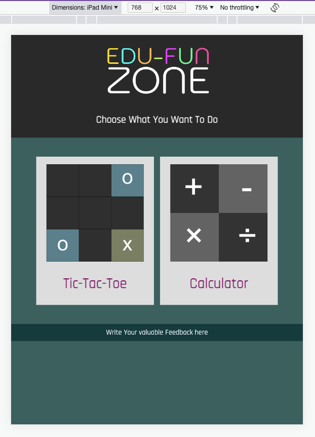
  - Surface pro
 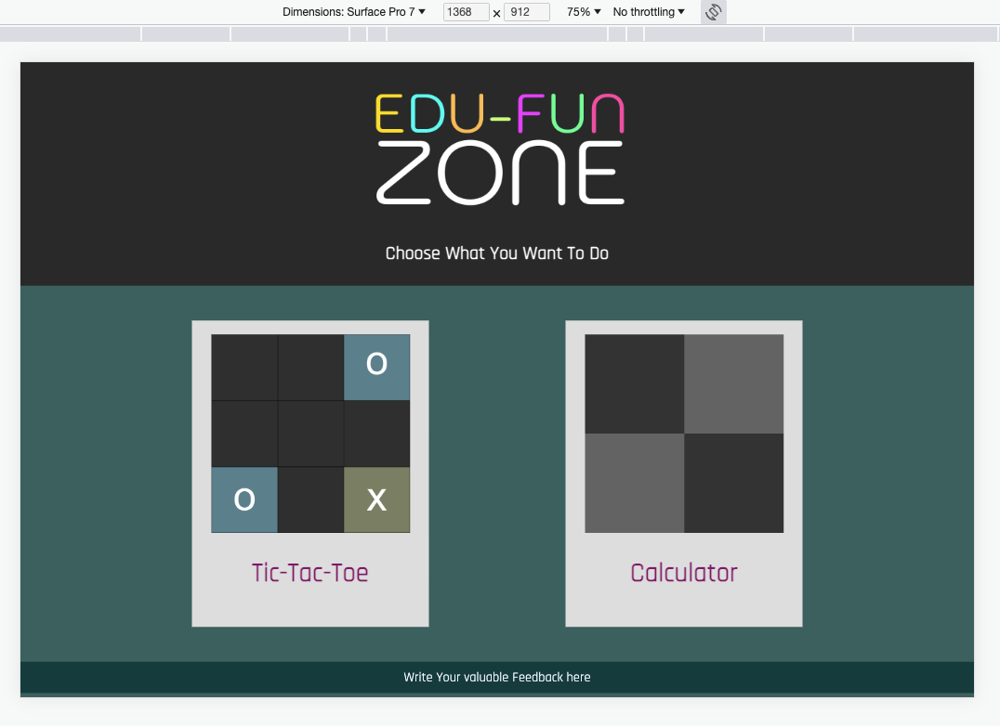
   - Iphone 12
 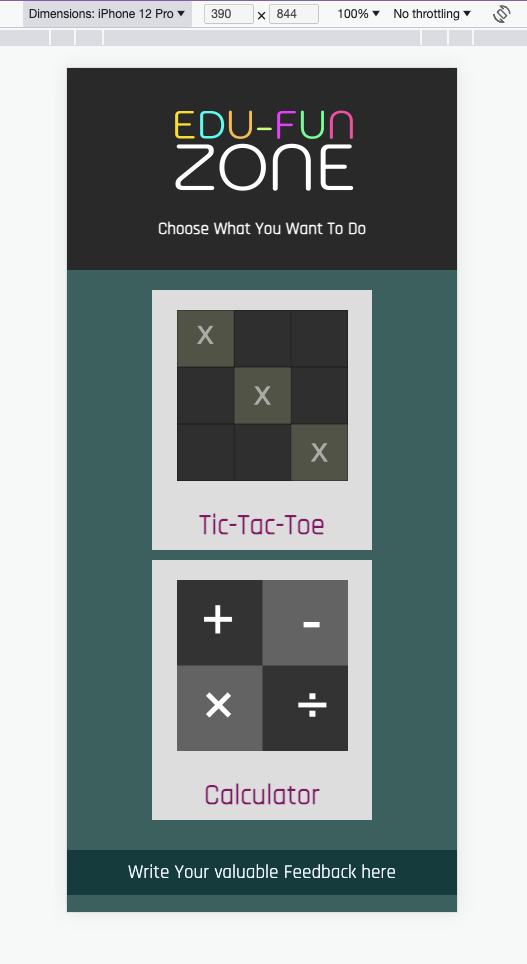
   - Samsung Galuxy S20 Ultra
 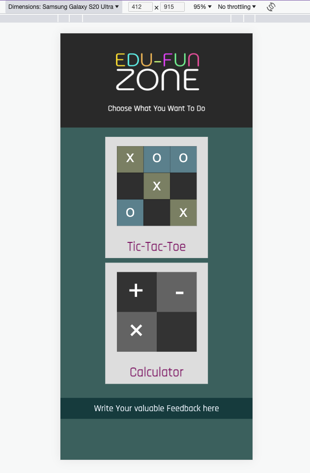

 ### All Pages in Iphone 12 pro
 - Home
 
- Tic Tac Toe
 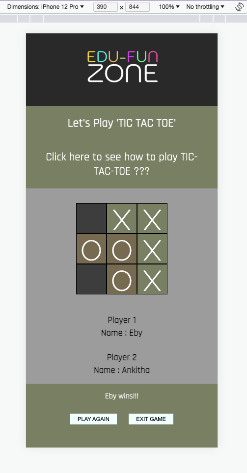
- Calculator
 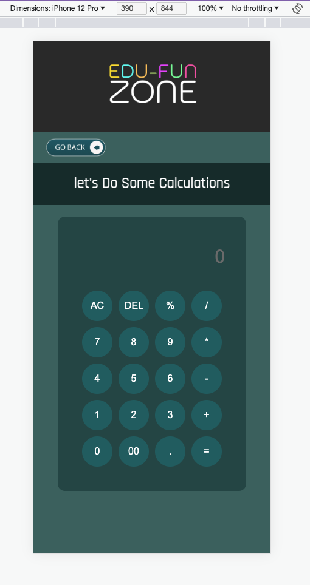
- How to play
 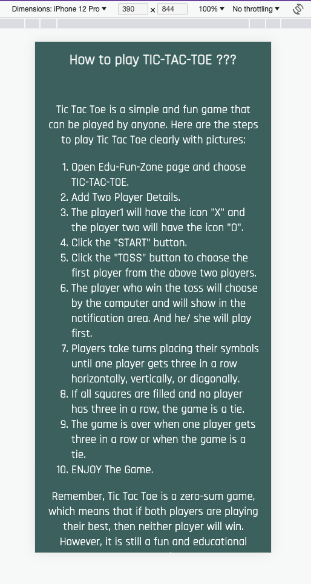
- Feedback form
 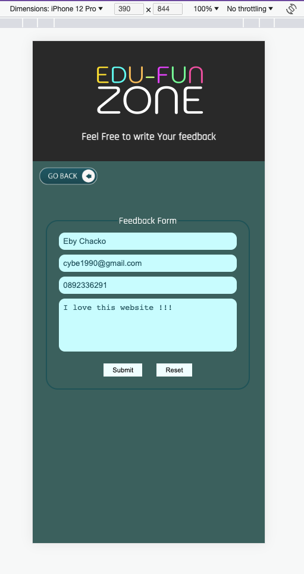
- submitted Feedback form
 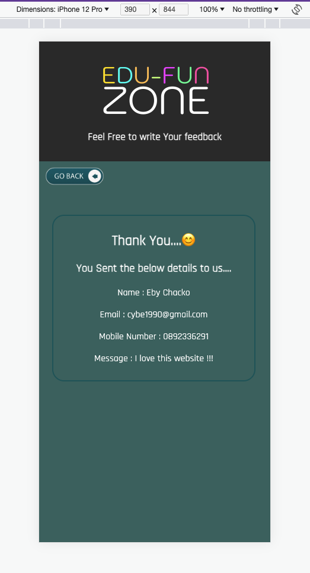

 ## Browser Compatibility testing
 For the Edu Fun Zone website I tested the browser compatibility using Safari, Google Chrome, and Microsoft Edge, and everything was found to be good.

## Errors
During testing with the Chrome Developer Tools, an error was encountered: "Uncaught TypeError: Cannot read properties of null (reading 'querySelectorAll')". This error occurs when trying to access the querySelectorAll method on a null value, specifically a DOM element that doesn't exist.

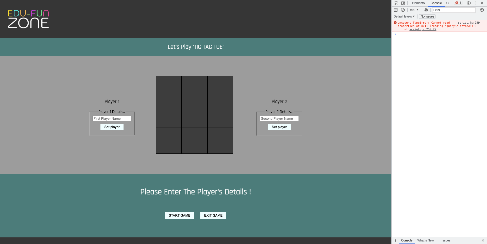

To resolve this error, the script file was split for each page. By doing this, the code ensures that the DOM elements it needs to access are available before attempting to use the 'querySelectorAll' method.

## Validator Testing 
- HTML
  - No errors were returned when passing through the official [W3C validator](https://validator.w3.org/nu/?doc=https%3A%2F%2Febychacko.github.io%2Fproject2_game%2F)
- CSS
  - No errors were found when passing through the official [W3C CSS validator](https://jigsaw.w3.org/css-validator/validator?uri=+https%3A%2F%2Febychacko.github.io%2Fproject2_game%2F&profile=css3svg&usermedium=all&warning=1&vextwarning=&lang=en)

- Java Script
    - When passing through the [jshint.com](https://jshint.com/), found some variables were seen undefined. I declare the variable to resolve the problem. No other issues found during test.
## Accessibility Test
During the Accessibility test conducted with WAVE, an error was identified: "Empty form label". This error occurs when a <label> tag is present in the form and associated with an input field, but does not contain any text.

To resolve this error, the added a label for each input section in the website. By adding descriptive text within the <label> tags, the form controls are now properly labeled, ensuring accessibility for all users.

No other errors were found when passing through the official WAVE Web Accessibility Evaluation Tool. 

[Check Result Here](https://wave.webaim.org/report#/https://ebychacko.github.io/project2_game/).

## Lighthouse
I used Lighthouse within the Chrome Developer Tools to test the performance, accessibility, best practices and SEO of the website.

### Desktop Results
All pages of the site are achieving a score 100 across the 4 categories in lighthouse for the desktop view.

- Home Page 

- TIC TAC TOE 

- Calculator 

- feedback 
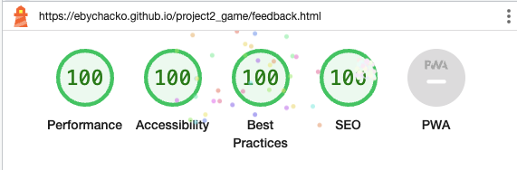
- How to play

### Mobile Results
All pages of the site are achieving a score above 90 across the 4 categories in lighthouse for the mobile view.
- Home Page 

- TIC TAC TOE 

- Calculator 

- feedback 

- How to play

## Manual Testing
Testing was performed on the following devices:
* Laptop:
  * Macbook Pro 2023 14 inch screen
* Mobile Devices:
  * iPhone 13 pro Max.

following browsers are used in the macbook Pro:

* Google Chrome
* Safari
* Microsoft Edge

### __Home page__
| Feature |  Testing Performed | Expected Outcome | Pass/Fail |
| --- | --- | --- | --- |
|Tic-Tac-Toe Gif image  | Hover over the div. | Background color Change | Pass|
|Tic-Tac-Toe Gif image  | Click | Load tic-tac-toe.html| Pass|
|Calculator Gif image   | Hover over the div. | Background color Change | Pass|
|Calculator Gif image  | Click | Load calculator.html| Pass|
|feedback text   | Hover over the text | Text color Change | Pass|
|Feedback text   | Click | load feedback.html| Pass|

### __Tic-Tac-Toe page__
| Feature |  Testing Performed | Expected Outcome | Pass/Fail |
| --- | --- | --- | --- |
| How to play text | Hover over the text | Text color change | Pass |
| How to play text | Click | Navigate to how-to-play.html | Pass |
| "Set player" button in player 1 | Click without player details | Show a message "Enter The Player Name" | Pass|
| "Set player" button in player 1 | Click with player details and before setting the player 2 details | Show a message "Enter The Player 2 Name" | Pass|
| "Set player" button in player 1 | Click with player details and after setting the player 2 details | Show a message "Let's Start The Game" | Pass|
| "Set player" button in player 2 | Click without player details | Show a message "Enter The Player Name" | Pass|
| "Set player" button in player 2 | Click with player details and before setting the player 1 details | Show a message "Enter The Player 1 Name" | Pass|
| "Set player" button in player 2 | Click with player details and after setting the player 1 details | Show a message "Let's Start The Game" | Pass|
| "START GAME" Button | Click without the player details | Show a message "Enter the players details First" | Pass |
| "START GAME" Button | Click with the player details | Show a message "Click the 'TOSS' button to choose the first player" and change the text on the button to "TOSS" | Pass |
|"TOSS button" | Click the button | Computer choose the first player from the two players randomly and change the text o the button change to "RESTART" and start the game | Pass |
|"RESTART" Button |Click button| Clear all the game and restart the game from the begining and the button text change to "TOSS"| pass|
|"EXIT GAME" button | click Button | Exit the game and load Home page | Pass |
|Cells for game | Hover Over each cell | Change color|Pass|
|Cells For Game | click when game not started | Nothing should happen | Pass |
|Cells For Game | click when game is on | Change color, change inner text, change the player for next turn  and test for the winner or the game is draw| Pass |

### __Calculator page__
| Feature |  Testing Performed | Expected Outcome | Pass/Fail |
| --- | --- | --- | --- |
| Key press Events |Any key press related to calculator (Numbers, operators,Enter, Esc or BackSpace) | It work as the normal calculator | Pass|
|"HOME PAGE" Button | Click | Load the home page | Pass |
|Buttons in the calculator | Click | Small Animation | Pass |
|"AC" Button | Click | Clear the display | Pass |
|"DEL" Button | Click | Delete one number from the display at the right hand side | Pass |
|Number Buttons | Click | If display is empty, show the number in the display | Pass|
|Number Buttons | Click | If display is not empty, add the numer to the right hand side of the display as the normal calculator | Pass|
|Operator Buttons | Click | All working as a normal basic calculator | Pass |
### __Feedback page__
| Feature |  Testing Performed | Expected Outcome | Pass/Fail |
| --- | --- | --- | --- |
|"HOME PAGE" Button | Click | Load the home page | Pass |
|"Submit" button | Click withot details | Show the fill the fields | Pass|
|"Submit" button | Click with details | Show the filled details with a thanks message in the same window | Pass|
|"Reset Button" | Click | Reset the form | Pass |

### __How to play page__
| Feature |  Testing Performed | Expected Outcome | Pass/Fail |
| --- | --- | --- | --- |
|"GO TO HOME PAGE" Button | Click | Load the home page | Pass |

### __404 page__
| Feature |  Testing Performed | Expected Outcome | Pass/Fail |
| --- | --- | --- | --- |
|"HOME PAGE" Button | Click | Load the home page | Pass |

Additional testing was taken by friends and family on a variety of devices and screen sizes. They reported no issues.

# Testing User Stories
## Home page

| Goals | How are they achieved? |
| :--- | :--- |
|Wanted to show animated icons in the home page for the game and the calculator | created the animated gif icons using the photoshop and insered using the img tag. |
|wanted a colourful logo | A colourfull logo created using Photoshop.|
| wanted a feedback form | A feedback form implemented in the home page |
|Colour Combinations | Used a unique colour combination troughout the website |

## Tic Tac Toe page 
| Goals | How are they achieved? |
| :--- | :--- |
|There should need to enter the details of the players| Gave the input field to enter the details and give a button to save the details for each player.
|The play area need to be at the middle of the page | When the page designed, created the collection of the playing cells are aligned at the center of the page.|
|needed a message text that help the player to understand what to do next | At the bottom of the play area, a dynamic message is always displayed, which changes based on the user actions.
|Separate icon and colour for each player | There are two deferent colours and icons allocated for two players. When a player click the cel, the cell colour changes to the colour that allocated for that player and when one player wins the background color of the whole website temporarly changes to the colourof the player who wins.|
|Navigation to home page | Add a "EXIT GAME" button to navigate to home page. |
|Wanted HOW TO PLAY details | Added a separate HTML page to describe how to play the TIC TAC TOE game using step by step description and images.

## Calculator page 
| Goals | How are they achieved? |
| :--- | :--- |
|Needed to operate using keyboard | Add event listener for the keypress for all the numbers, operators, Enter, Esc and BackSpace. Also prevented the default keypress events|
|Wanted a simple calculator | Created a fully functioning Calculator that perform arithmetic operations like Addition, Substraction, Multiplicatin, Division and Persentage calculation |

# Deployment
The project was deployed on GitHub Pages. I used VS Code as a development environment where I commited all changes to git version control system. I used push command in VS Code to save changes into GitHub.

To deploy a project I had to:

* Log in to GitHub and click on repository to deploy ([project2_game](https://github.com/EbyChacko/project2_game.git))
* select `Settings` and find GitHub Pages section on the left side bar.
* from source select `Deploy from a branch` and then select `main` branch.
* click `save` and page was deployed after auto-refresh.

>  Site is published at https://ebychacko.github.io/project2_game/

## How to Fork
To fork the repository:

1. Log in (or sign up) to Github.
2. Go to the repository for this project, [project2_game](https://github.com/EbyChacko/project2_game.git)
3. Click the Fork button in the top right corner.

## How to Clone

To clone the repository:

1. Log in (or sign up) to GitHub.
2. Go to the repository for this project, [project2_game](https://github.com/EbyChacko/project2_game.git)
3. Click on the code button, select whether you would like to clone with HTTPS, SSH or GitHub CLI and copy the link shown.
4. Open the terminal in your code editor and change the current working directory to the location you want to use for the cloned directory.
5. Type 'git clone' into the terminal and then paste the link you copied in step 3. Press enter.

# Future Maintainability
The future maintainability of the Edu Fun Zone website, which includes two main features - a calculator and a Tic Tac Toe game, will depend on several factors. Here are some considerations:

* Code structure: The website's code should be well-organized and follow best practices to ensure readability and maintainability. 

* Documentation: Clear and comprehensive documentation of the codebase, including comments and explanations of the logic and functionality, can greatly aid in future maintenance. It helps new developers understand the code and make necessary changes or updates.

* Version control: Utilizing version control systems like Git and GitHub allows for easy tracking of changes, collaboration among developers, and the ability to revert to previous versions if needed. This ensures that any modifications or updates can be managed effectively.

* Responsive design: As technology evolves, it is important to ensure that the website remains compatible with different devices and screen sizes. Implementing responsive design principles allows the website to adapt to various platforms, ensuring a consistent user experience.

By considering these factors, the Edu Fun Zone website can be maintained effectively, allowing for future updates, improvements, and enhancements to its calculator and Tic Tac Toe game features.

# Credits 

* To complete this project I used Code Institute student template: [gitpod full template](https://github.com/Code-Institute-Org/gitpod-full-template)

## Code

Perplexity is an AI based chatbot, that helped to clear the doubts through out this project. I used perplexity to correct the code as well.

* [Perplexity AI](https://www.perplexity.ai/)

## Idea

Youtube videos helped to find the project topic and watched a number of videos to get the idea how to create the tic-tac-toe game and calculator.

* [Youtube](https://www.youtube.com/)